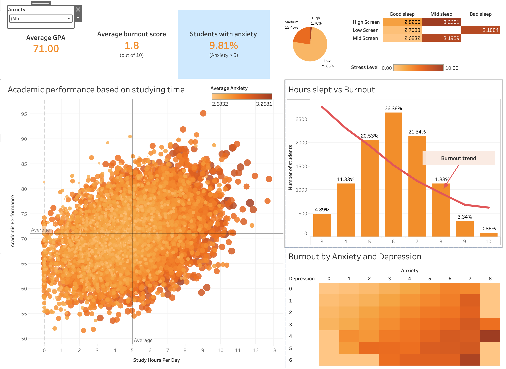

# NST DVA Capstone 2 - Project Repository

> **Newton School of Technology | Data Visualization & Analytics**
> A 2-week industry simulation capstone using Python, GitHub, and Tableau to convert raw data into actionable business intelligence.

---

## Project Overview

| Field | Details |
|---|---|
| **Project Title** | Student Mental Health & Burnout: A Data-Driven Risk Analysis |
| **Sector** | EdTech / Higher Education |
| **Team ID** | Mera Bharat Mahan |
| **Section** | Ramanujan |
| **Faculty Mentor** | Kajal Badlani |
| **Institute** | Newton School of Technology |
| **Submission Date** | 28-04-2026 |

### Team Members

| Role | Name | GitHub Username |
|---|---|---|
| Project Lead | Hemant Yadav |  `https://github.com/hk2166` |
| Data Lead | Yashpreet Gupta |  `https://github.com/Yashpreetg24` |
| ETL Lead | Kartik Puri | `https://github.com/BOXER78` |
| Analysis Lead | Bhavish Dhar |  `https://github.com/bhavish-codes` |
| Visualization Lead | Bharat Singh |  `https://github.com/BharatSingh2004` |
| Strategy Lead | Bhavish Dhar |  `https://github.com/bhavish-codes` |
| PPT and Quality Lead | Yashpreet Gupta |  `https://github.com/Yashpreetg24` |

---

## Business Problem

Universities face a growing student mental health crisis. Burnout — characterised by emotional exhaustion, reduced academic efficacy, and disengagement — is a leading cause of dropout and poor academic outcomes. Most institutions lack a systematic, data-driven method to identify at-risk students before the situation becomes critical.

**Core Business Question**

> Which student characteristics and behaviours most strongly predict burnout and dropout risk, and how can this be used to prioritise welfare interventions?

**Decision Supported**

> Academic administrators and welfare teams can use the Tableau dashboard to identify high-risk student segments by academic year, gender, sleep pattern, and stress level — enabling targeted, early intervention before burnout escalates to dropout.

---

## Dataset

| Attribute | Details |
|---|---|
| **Source Name** | Kaggle — synthetic student mental health simulation dataset |
| **Direct Access Link** | https://www.kaggle.com/datasets/adilshamim8/student-mental-health-and-burnout-dataset |
| **Row Count** | 1,000,000 |
| **Column Count** | 20 (raw) → 33 (Tableau-ready) |
| **Time Period Covered** | Cross-sectional (no time dimension) |
| **Format** | CSV |
| **Row Count** | 1,000,000 |
| **Column Count** | 20 (raw) → 33 (Tableau-ready) |
| **Time Period Covered** | Cross-sectional (no time dimension) |
| **Format** | CSV |

**Key Columns Used**

| Column Name | Description | Role in Analysis |
|---|---|---|
| `burnout_score` | Overall burnout severity score (0–10) | Primary KPI and regression target |
| `dropout_risk` | Predicted dropout risk score (0–10) | Secondary KPI |
| `mental_health_index` | Composite mental health score (0–10, higher = better) | KPI |
| `stress_level` | Self-reported stress level (0–10) | Top predictor |
| `anxiety_score` | Anxiety severity score (0–10) | Top predictor |
| `depression_score` | Depression severity score (0–10) | Top predictor |
| `sleep_hours` | Average nightly sleep hours | Protective factor / filter |
| `social_support` | Perceived social support score (0–10) | Protective factor |
| `risk_level` | Categorical risk: Low / Medium / High | Segmentation filter |
| `academic_year` | Year of study 1–4 | Trend analysis / filter |

For full column definitions, see [`docs/data_dictionary.md`](docs/data_dictionary.md).

---

## KPI Framework

| KPI | Definition | Formula / Computation |
|---|---|---|
| Mean Burnout Score | Average burnout severity across all students | `mean(burnout_score)` — notebook 05 |
| High-Risk Rate % | Percentage of students classified as High risk | `count(risk_level == 'High') / total * 100` — notebook 05 |
| Mean Dropout Risk | Average dropout risk score | `mean(dropout_risk)` — notebook 05 |
| Mean Mental Health Index | Average composite mental health score | `mean(mental_health_index)` — notebook 05 |
| Burnout by Academic Year | Mean burnout score per year of study | `groupby(academic_year).mean(burnout_score)` — notebook 03 |
| Anxiety Norm | Normalised anxiety for cross-metric comparison | `(anxiety_score − min) / (max − min)` — notebook 05 |
| Support Norm | Normalised social support | `(social_support − min) / (max − min)` — notebook 05 |

Document KPI logic clearly in `notebooks/04_statistical_analysis.ipynb` and `notebooks/05_final_load_prep.ipynb`.

---

## Tableau Dashboard

| Item | Details |
|---|---|
| **Dashboard URL** | https://github.com/bhavish-codes/Mock-thetha_Mera_Bharat_Mahan_Student_Mental_Health_Burnout_Analysis |
| **Global Filter** | Anxiety score dropdown — filters all panels simultaneously |
| **KPI Cards** | Average GPA (71.00), Average Burnout Score (1.8/10), Students with Anxiety >5 (9.81%) |
| **Risk Level Pie** | Low 75.85% / Medium 22.45% / High 1.70% |
| **Screen × Sleep Heatmap** | Burnout by Screen time sectors (High/Low/Mid) × Sleep quality (Good/Mid/Bad) — peak: 3.27 |
| **Scatter Plot** | Academic Performance vs Study Hours Per Day, coloured by Average Anxiety |
| **Sleep vs Burnout** | Dual-axis bar (student count %) + burnout trend line across sleep hours 3–10 |
| **Anxiety × Depression Heatmap** | Average Burnout Score by Anxiety (0–8) and Depression (0–6) bins |

### Dashboard Preview



---

## Key Insights

1. Average burnout is 1.8/10, but the distribution is right-skewed — the mean hides a critical high-risk tail where 1.70% of students are classified High risk.
2. 9.81% of students have Anxiety Score > 5 — nearly 1 in 10 is above the clinical concern threshold, impacting academic functioning.
3. Bad sleep is the most consistent burnout amplifier — across all screen time levels, the Bad sleep column shows the highest burnout in the heatmap.
4. High screen time + bad sleep is the worst combination — producing the peak burnout score of 3.27 in the screen × sleep heatmap.
5. Most students are sleep-deprived — 36% sleep 5 hours or fewer; the burnout trend line confirms burnout falls with every additional hour of sleep.
6. Study hours do not linearly predict academic performance — the scatter shows a wide cloud with no strong upward trend.
7. Anxiety breaks the study–performance link — high-anxiety students (dark bubbles) underperform regardless of study hours, making anxiety management as important as academic support.
8. Anxiety and depression compound burnout — the heatmap shows a diagonal gradient; students with both high anxiety and high depression face the highest burnout risk.
9. Over 22% of students are in the Medium risk band — large enough to represent a systemic risk requiring preventive action, not just crisis response.
10. Average GPA of 71.00 combined with 9.81% anxiety prevalence signals a population functioning under meaningful strain that is not yet visible in aggregate performance metrics.

---

## Recommendations

| # | Insight | Recommendation | Expected Impact |
|---|---|---|---|
| 1 | 9.81% of students have Anxiety > 5 | Mandatory anxiety screening at semester start; refer students scoring above 5 to counselling | Reduce anxiety prevalence before it escalates to burnout |
| 2 | Bad sleep amplifies burnout across all screen time levels | Launch a sleep hygiene programme targeting students sleeping ≤5 hours | Shift students into the 6–7h sleep range where burnout drops sharply |
| 3 | High screen time + bad sleep = peak burnout (3.27) | Set campus digital wellness guidelines; promote screen-free wind-down periods before sleep | Reduce the worst burnout cell in the screen × sleep heatmap |
| 4 | Anxiety disrupts the study–performance relationship | Provide anxiety management workshops alongside academic support | Restore study–performance conversion for the ~10% with Anxiety > 5 |
| 5 | Anxiety and depression compound burnout diagonally | Create a dual-support counselling pathway for students flagged high on both anxiety and depression | Reduce burnout in the high-anxiety + high-depression quadrant |

---

## Repository Structure

```text
SectionName_TeamID_ProjectName/
|
|-- README.md
|
|-- data/
|   |-- raw/                         # Original dataset (never edited)
|   `-- processed/                   # Cleaned output from ETL pipeline
|
|-- notebooks/
|   |-- 01_extraction.ipynb
|   |-- 02_cleaning.ipynb
|   |-- 03_eda.ipynb
|   |-- 04_statistical_analysis.ipynb
|   `-- 05_final_load_prep.ipynb
|
|-- scripts/
|   `-- etl_pipeline.py
|
|-- tableau/
|   |-- screenshots/
|   `-- dashboard_links.md
|
|-- reports/
|   |-- README.md
|   |-- project_report_template.md
|   `-- presentation_outline.md
|
|-- docs/
|   `-- data_dictionary.md
|
|-- DVA-oriented-Resume/
`-- DVA-focused-Portfolio/
```

---

## Analytical Pipeline

The project follows a structured 7-step workflow:

1. **Define** - Sector selected, problem statement scoped, mentor approval obtained.
2. **Extract** - Raw dataset sourced and committed to `data/raw/`; data dictionary drafted.
3. **Clean and Transform** - Cleaning pipeline built in `notebooks/02_cleaning.ipynb` and optionally `scripts/etl_pipeline.py`.
4. **Analyze** - EDA and statistical analysis performed in notebooks `03` and `04`.
5. **Visualize** - Interactive Tableau dashboard built and published on Tableau Public.
6. **Recommend** - 3-5 data-backed business recommendations delivered.
7. **Report** - Final project report and presentation deck completed and exported to PDF in `reports/`.

---

## Tech Stack

| Tool | Status | Purpose |
|---|---|---|
| Python + Jupyter Notebooks | Mandatory | ETL, cleaning, analysis, and KPI computation |
| Google Colab | Supported | Cloud notebook execution environment |
| Tableau Public | Mandatory | Dashboard design, publishing, and sharing |
| GitHub | Mandatory | Version control, collaboration, contribution audit |
| SQL | Optional | Initial data extraction only, if documented |

**Recommended Python libraries:** `pandas`, `numpy`, `matplotlib`, `seaborn`, `scipy`, `statsmodels`

---

## Evaluation Rubric

| Area | Marks | Focus |
|---|---|---|
| Problem Framing | 10 | Is the business question clear and well-scoped? |
| Data Quality and ETL | 15 | Is the cleaning pipeline thorough and documented? |
| Analysis Depth | 25 | Are statistical methods applied correctly with insight? |
| Dashboard and Visualization | 20 | Is the Tableau dashboard interactive and decision-relevant? |
| Business Recommendations | 20 | Are insights actionable and well-reasoned? |
| Storytelling and Clarity | 10 | Is the presentation professional and coherent? |
| **Total** | **100** | |


---

## Submission Checklist

**GitHub Repository**

- [ ] Public repository created with the correct naming convention (`SectionName_TeamID_ProjectName`)
- [ ] All notebooks committed in `.ipynb` format
- [ ] `data/raw/` contains the original, unedited dataset
- [ ] `data/processed/` contains the cleaned pipeline output
- [ ] `tableau/screenshots/` contains dashboard screenshots
- [ ] `tableau/dashboard_links.md` contains the Tableau Public URL
- [ ] `docs/data_dictionary.md` is complete
- [ ] `README.md` explains the project, dataset, and team
- [ ] All members have visible commits and pull requests

**Tableau Dashboard**

- [ ] Published on Tableau Public and accessible via public URL
- [ ] At least one interactive filter included
- [ ] Dashboard directly addresses the business problem

**Project Report**

- [ ] Final report exported as PDF into `reports/`
- [ ] Cover page, executive summary, sector context, problem statement
- [ ] Data description, cleaning methodology, KPI framework
- [ ] EDA with written insights, statistical analysis results
- [ ] Dashboard screenshots and explanation
- [ ] 8-12 key insights in decision language
- [ ] 3-5 actionable recommendations with impact estimates
- [ ] Contribution matrix matches GitHub history

**Presentation Deck**

- [ ] Final presentation exported as PDF into `reports/`
- [ ] Title slide through recommendations, impact, limitations, and next steps

**Individual Assets**

- [ ] DVA-oriented resume updated to include this capstone
- [ ] Portfolio link or project case study added

---

## Contribution Matrix

This table must match evidence in GitHub Insights, PR history, and committed files.

| Team Member | Dataset & Sourcing | ETL & Cleaning | EDA & Analysis | Statistical Analysis | Tableau Dashboard | Report Writing | PPT & Viva |
|---|---|---|---|---|---|---|---|
| Hemant Yadav | Owner | Support | Support | Support | Support | Support | Support |
| Yashpreet Gupta | Support | Support | Owner | Support | Support | Owner | Owner |
| Kartik Puri | Support | Owner | Support | Support | Support | Support | Support |
| Bhavish Dhar | Support | Support | Support | Owner | Support | Owner | Support |
| Bharat Singh | Support | Support | Support | Support | Owner | Support | Support |

_Declaration: We confirm that the above contribution details are accurate and verifiable through GitHub Insights, PR history, and submitted artifacts._

**Team Lead Name:** Hemant Yadav

**Date:** 28-04-2026

---

*Newton School of Technology - Data Visualization & Analytics | Capstone 2*
